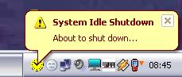

## Idle Win Shutdown

### Description

This little application runs in the system tray and shuts down Windows and switches of your PC after an adjustable period of user idleness, ie no mouse or keyboard activity. Running processes are queried as to whether they have any objections to system shutdown and are forcibly terminated if they don't object or do not respond to the session end notifications.
 
### More Info
 

             |
---                |---
**Submitted On**   |2007-02-02 10:00:02
**By**             |[ULLI](https://github.com/Planet-Source-Code/PSCIndex/blob/master/ByAuthor/ulli.md)
**Level**          |Intermediate
**User Rating**    |5.0 (10 globes from 2 users)
**Compatibility**  |VB 6\.0
**Category**       |[Miscellaneous](https://github.com/Planet-Source-Code/PSCIndex/blob/master/ByCategory/miscellaneous__1-1.md)
**World**          |[Visual Basic](https://github.com/Planet-Source-Code/PSCIndex/blob/master/ByWorld/visual-basic.md)
**Archive File**   |[Idle\_Win\_S204593222007\.zip](https://github.com/Planet-Source-Code/ulli-idle-win-shutdown__1-67774/archive/master.zip)

